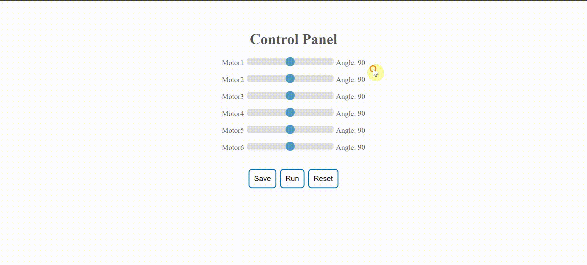

# Control_Panel

This project to move robot arm using control panel interface

## Steps:
  - Set motors angles
  - Save angles
  - Run robot

## Requirements:
  - XAMPP

## Configuration:
  - Stop all programs using `port 80` to run Apache: 
    - Admin cmd: `net stop http`

## Demo

